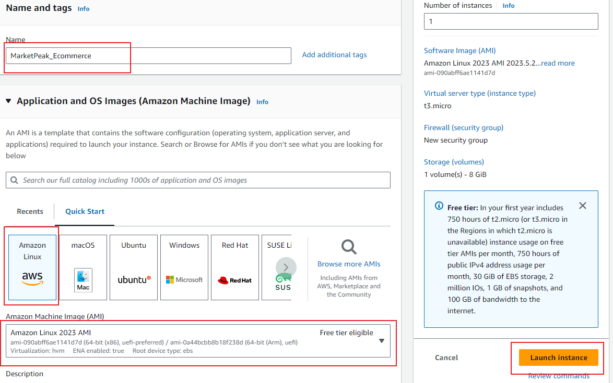
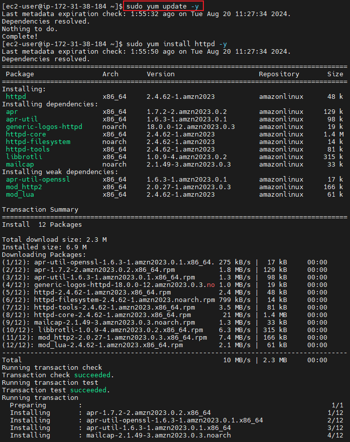

# Capstone Project #2: E-Commerce Platform Deployement with Git, Linux, and AWS 

## Project Scenario 

I was assigned to develop an e-commerce webstite for a new online marketplace named `MarketPeak.` The platform will feature product listings, a shopping cart, and user authentication. I am expected to utilize Git for version control, develop the platform in a Linux environment, and deploy it on an AWS EC2 instance. 

## Objectives 
1. Repository implementation 
2. Working with Git: branch, staging, commit, and pushing. 
3. Website implementation from templates in a Linux environment and deploying on AWS EC2.

## Step 1: Setting up the Repository.

### Tasks: 
1. Still working with my centralized repository `Darey.io_DevOps_Project`, I made a new diretory and named it `02.MarketPeak_Ecommerce` to follow my naming convention.

2. I changed directory `cd` to initialize the git repository and manage the version control.

3. Git repository is initialized 

4. An image folder `img` is essential to have all the images used in a centralized location.

5. Lastly the `README.md` file is added for proper documentation. 

## Step 2: Preparing the Website Template to be Used.

### Tasks:
1. I downloaded the template and extracted it to the project directory. 

2. Staged all the updates made 

3. I went ahead to set up git global configuration with my username 

        and email.

4. Commit the updates 

## Step 3: Set up an AWS EC2 Instance 

### Tasks:
1. Accessed the aws website then to launch and EC2 instance 

2. Named the instance `MarketPeak_Ecommerce`, selected `Amazon Linux AMI` and launched.

 Launched successfully 

## Step 4: Connect to the Instance on Linux Server and Clone the Repository

### Tasks:
1. I connected to the AWS AMI instance by copying the connect code from the aws management portal.

2. I generated a public ssh `id_rsa.pub` public key to connect with github

3. Entered the directory where the key is located to copy out and paste in github

    b. ssh pasted in github under settings

4. To successfully clone the repository from github to the server, I installed git `sudo yum install git`

5. All that's left is to copy the `HTTPS` link from github repository and paste to the server.

## Step 5: Install a Webserver on EC2 

### Tasks:
1. I installed an Apache webserver on the EC2 instance

2. Start and enable the apache server 

3. I then configured the server for the website so as to point to the directory on the linux server. First I removed the default web direcory and copied the MarketPeak_Ecommerce to it

    b. copied new directory to it

 

4. Reload the changes by reloading the httpd service

5. After all, I was able to see the website 

## Step 6: Continuous Integration and Development Workflow 

### Tasks:
1. I set up a `development branch` to ensure a smooth workflow for developing, testing and deploying. This isolates new features and bug fixes from the stable version of the website 

