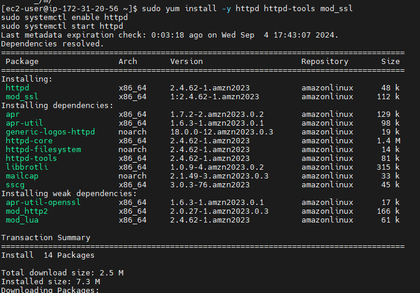
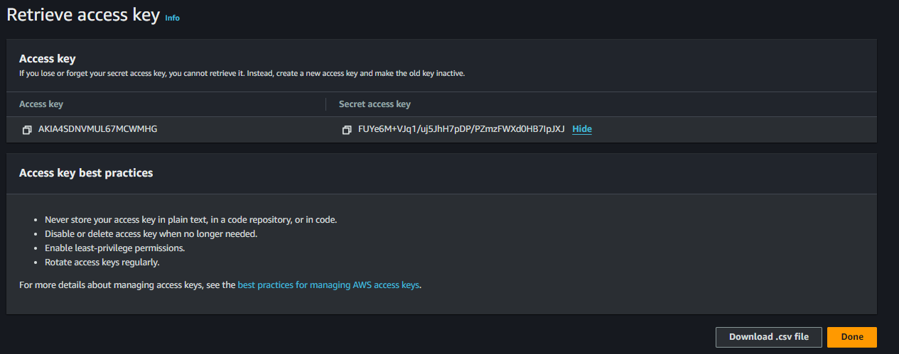
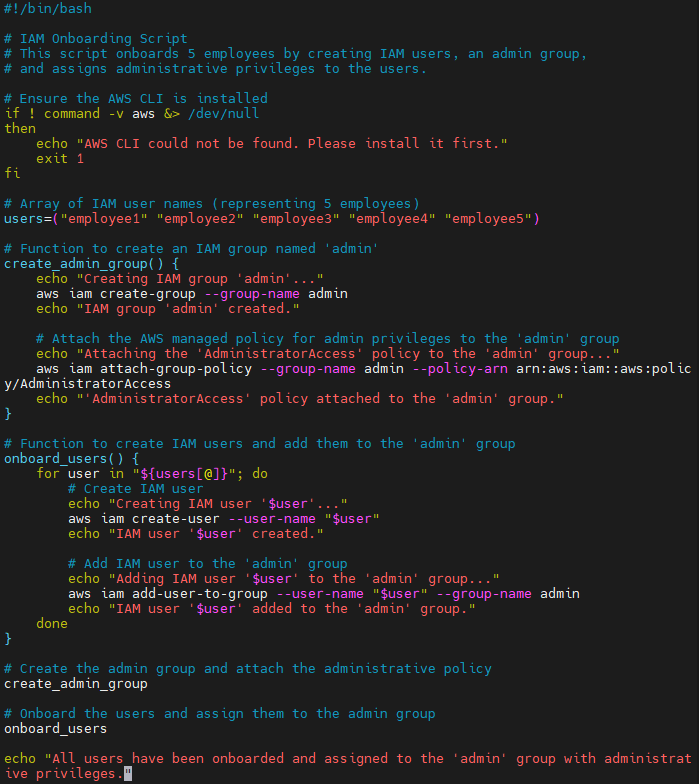
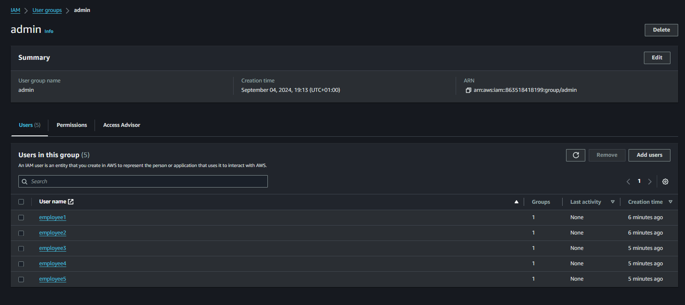

# Capstone Project #5: Shell Script for AWS IAM Management

## Project Scenario
Datawise Solutions requires an efficient management of their AWS IAM. I am tasked to write a shell script for its team that needs to onboard five new employees to access AWS resources securely. 

## Objectives
1. Script enhancement
2. Define IAM user names array
3. Create IAM users.
4. Create IAM group.
5. Attach administrative policy to group.
6. Assign users to group.

## Step 1: Prepare the documentation

# Tasks

1. Created the file `aws_cloud_manager.sh`

```markdown
touch aws_cloud_manager.sh
```


2. Gave the file execute permission

```markdown
chmod +x aws_cloud_manager.sh
```


3. Ensure they have AWS CLI imstalled 

```markdown
if ! command -v aws &> /dev/null
then
    echo"AWS CLI could not be found. Please install it first."
    exit 1
fi
```


4. Create an array for the employees to be onboarded

```markdown
users=("employee1" "employee2" "employee3" "employee4" "employee5")
```


5. Create admin group 

```markdown
create_admin_group(){
    echo"CReating IAM group 'admin' ..."
    aws iam create-group --group-name admin
    echo "IAM group 'admin' created."
}
```


6. Attach the admin group to the admin policy 

```markdown
echo"Attaching the "AdministratorAccess' policy attached to the 'admin' group..."
aws iam attach-group-policy --group-name admin --policy-arn arn:aws:iam::aws:policy/AdministratorAccess
echo "'AdministratorAccess' policy attached to the 'admin' group."
```


7. Create the users to be onboarded

```markdown
for user in "${users[@]}"; do
echo "Creating IAM user '$user'..."
echo "IAM ser '$user' created."
```


8. Add all the created users to the admin group

```markdown
echo "Adding IAM user '$user' to the 'admin' group..."
aws iam add-user-to-group --user-name "$user" --group-name admin
echo "IAM user '$user' added to the 'admin' group."
done
```


9. Attach the admnin policy to the admin group created


10. Onboard the users


## Step 2: Set up the Server and deploy

1. Launch an EC2 instance 


2. Install, setup and enable Apache server 



3. Install AWS CLI


4. Create access key on IAM AWS




5. Configure the access key to the apache server


6. Create the file for the shell script


7. Grant the file permission to be executable 


8. Vim into the file and paste the code 



9. Run the shell script to carry out the script


10. Script running perfectly. Creating admin group


11. Attaching the admin policy to the `admin` group


12. Script creating the users `empployee1`


13. Script is adding the `employee1` to the admin group


14. Script creating `employees 2,3,4,& 5`


15. Script successfully completed the onboarding process


## Step 3: Confirm Onboarding on the AWS instance

1. Confirm group creation 


2. All employees successfully added to group



3. All employees having admin policy

