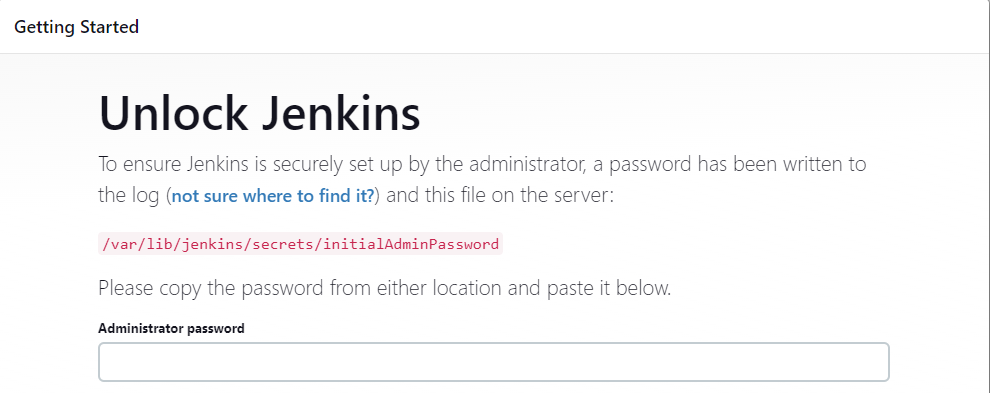
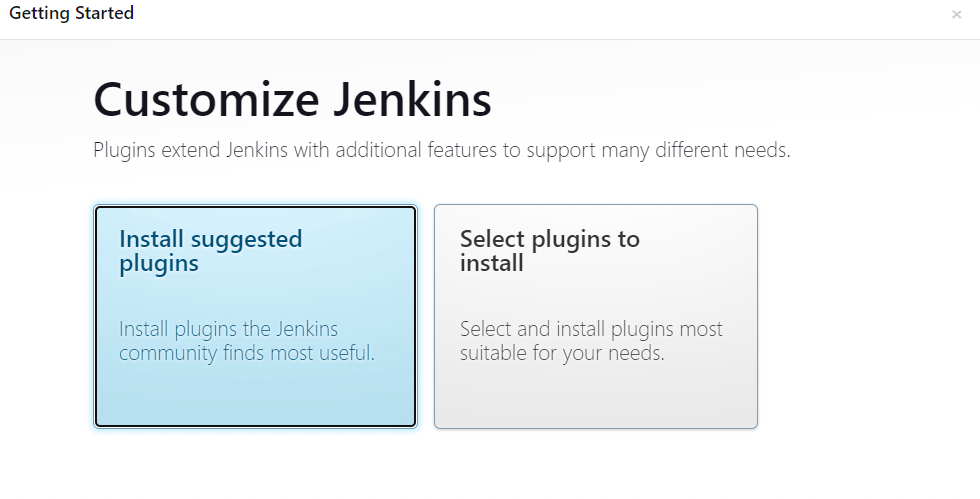

# Capstone Project #7: CI/CD Mastery

## Project Scenario
As a DevOps Engineer, I'm tasked to design and implement a robust CI/CD pipeline using Jenkins to automate the deployment of a web application. The goal is to achieve continuos integration and continuos deployment, and ensure the reliability of the applications.

## Objectives

1. Jenkins, Github, Pipelines and docker.

## Project Components:
## 1. Jenkins Server Setup

### Objective
Configure Jenkins server for CI/CD pipeline automation.

### Steps:
1. Install Jenkins on a dedicated server.

    ### Tasks:
    1. Set up AWS instance
    

    2. SSH connect to instance
    

    3. Update 
    ```markdown
    sudo apt update
    ```

    4. Install JDK
    ```markdown
    sudo apt install default-jdk-headless
    ```

    5. Install Jenkins 
   ```markdown
    wget -q -O - https://pkg.jenkins.io/debian-stable/jenkins.io.key | sudo apt-key add -
    sudo sh -c 'echo deb https://pkg.jenkins.io/debian-stable binary/ > \
    /etc/apt/sources.list.d/jenkins.list'
    sudo apt update
    sudo apt-get install jenkins
   ```

   6. Jenkins running on port 8080
   
   

   7. Cat the password to login
   ```markdown
   sudo cat /var/lib/jenkins/secrets/initialAdminPassword
   ```
   
   8. Plugins Installed
   
   

   9. Setting up the user 
   

   Instance Config
   

2. Source Code Management Repository Integration.

    ## Tasks:
    1. Integrate Jenkins with the source code (Github)


