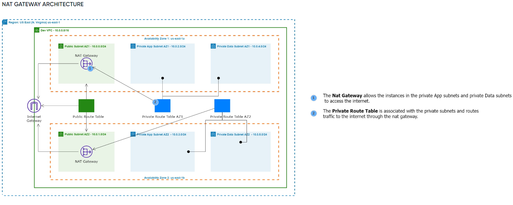
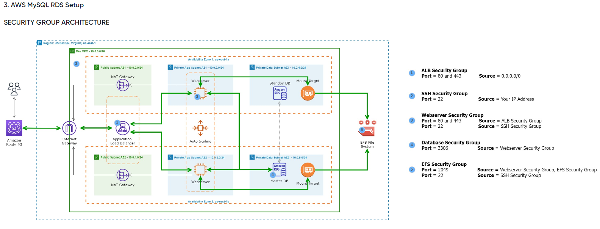

# Capstone Project #9: Terraform Automated Wordpress Deployment on AWS

In this project, I'm creating an high-performance, scalable, secure and cost-effective wordpress website for my client `DigitalBoost` using various AWS services and automating it through terraform. Terraform is the key to achieve a streamlined and reproducible deployment process. 


## Task 1: VPC Setup

The aim is to create a VPC to isolate and secure the wordpress infrastructure. 

I used terraform to define the VPC, availability zones, internet gateways, subnets and route tables, leveraging variables for customization and document the commands for execution. I employed the modular structure for the setup, declaring every resource in it's own module for easy read and configuration. Example:

```markdown
root-directory/
  ├── main.tf                  # Root configuration file
  ├── modules/
  │   └── ec2/
  │       └── main.tf          # EC2 module with bastion host

```


`Define the AWS provider. NB, the access and secret key were preconfigured using aws cli earlier.`

```markdown
# Define the provider
provider "aws" {
  region = "us-east-1"
  
}

```

`VPC`

```markdown
# Create VPC resource
resource "aws_vpc" "main" {
    cidr_block  = var.cidr
    tags        = {
    Name        = "main-vpc"
  }
}

# Assign VPC variable
variable "cidr" {
    description = "VPC CIDR block"
    type = string
    default = "10.0.0.0/16"
    sensitive = true
}

# Show the output of the VPC created
output "vpc_id" {
    description = "The ID of the VPC"
    value = aws_vpc.main.id

}
```
`Availability Zones`

```markdown
# Availablilty Zones Variable
variable "az" {
    description = "Availabiilty zones list"
    type = list(string)
    default = [ "us-east-1a", "us-east-1b" ]
    sensitive = true 
}
```

`Internet Gateway`

```markdown
# Create Internet Gateway
resource "aws_internet_gateway" "igw" {
  vpc_id = aws_vpc.main.id

  tags = {
    Name = "main-igw"
  }
}
```

`Public Subnets for AZ1 & AZ2`

```markdown
# Create the public subnets for AZ1
resource "aws_subnet" "az1_public_subnets" {
    vpc_id              = aws_vpc.main.id
    cidr_block          = var.public_subnets[0]
    availability_zone   = var.az[0]  

  tags = {
    Name = "public_subnet_${0}"
  }
}

# Create the public subnets for AZ2
resource "aws_subnet" "az2_public_subnets" {
    vpc_id              = aws_vpc.main.id
    cidr_block          = var.public_subnets[1]
    availability_zone   = var.az[1]  

  tags = {
    Name = "public_subnet_${1}"
  }
}

# Public Subnets Variable
variable "public_subnets" {
    description = "List of public subnets cidr"
    type = list(string)
    default = [ "10.0.0.0/24", "10.0.1.0/24" ]
}

# Output of the public subnets ids
output "public-subnets_ids" {
    description = "The ID's of public subnets created"
    value       = aws_subnet.public_subnets.id  
}

```

`Private AZ1 subnets and variables`

```markdown
# Create the private az1 (app & data) subnets 
resource "aws_subnet" "private_az1_group_subnets" {
    count               = length(var.private_az1_subnets)
    vpc_id              = aws_vpc.main.id
    cidr_block          = var.private_az1_subnets[count.index]
    availability_zone   = var.az[0]

    tags = {
      Name = "private_app_subnet_${count.index}"
    }
}

# Private AZ1 Subnets Variable
variable "private_az1_subnets" {
    description = "List of private-az1 subnets cidr"
    type = list(string)
    default = [ "10.0.2.0/24", "10.0.4.0/24" ]  
}

# Output of private az1 subnets ids
output "private_az1_subnets_ids" {
    description = "The ID's of private-app subnets created"
    value = aws_subnet.private_az1_subnets.id  
}


```

`Private AZ2 subnets and variables`

```markdown

# Create the private az2 (app & data) subnets  
resource "aws_subnet" "private_az2_group_subnets" {
    count               = length(var.private_az2_subnets)
    vpc_id              = aws_vpc.main.id
    cidr_block          = var.private_az2_subnets[count.index]
    availability_zone   = var.az[1]

    tags = {
      Name = "private_subnet_${count.index}"
    }
  
}

# Private AZ2 Subnets Variable
variable "private_az2_subnets" {
    description = "List of private-az2 subnets cidr"
    type = list(string)
    default = [ "10.0.3.0/24", "10.0.5.0/24" ]  
}

# Output of private az2 subnets ids
output "private_az2_subnets_ids" {
    description = "The ID's of private-data subnets created"
    value = aws_subnet.private_az2_subnets.id  
}


```

## Task 2: NAT Gateway in Public Subnets to Route Private Subnet to Internet

The aim is to implement a secure network architecture with public and private subnets. Using NAT gateway for private subnet internet access.

I used terraform to define the subnets, security groups and NAT Gateway, ensuring proper association of resources with corresponding subnets. 



1. The NAT gateway needs an elastic IP and route table to properly connect the private subnets to the internet

`Elastic Ip for AZ1 & AZ2`

```markdown
# Create Elastic IP for the NAT gateway AZ1

resource "aws_eip" "for_az1_NAT" {
  vpc = true
}

# Create Elastic IP for the NAT gateway AZ2

resource "aws_eip" "for_az2_NAT" {
  vpc = true
}

```

`Routing Table Hosting the 2 Subnets (Public and Private)`

```markdown
# Create the public route table for the public subnets
resource "aws_route_table" "public_route_table" {
  vpc_id = aws_vpc.main.id

  route {
    cidr_block  = var.public_subnets[count.index]
    gateway_id  = aws_internet_gateway.igw.id
  }
}

# Create the private-az1 route table for the private subnets
resource "aws_route_table" "private_az1_route_table" {
  vpc_id = aws_vpc.main.id

  route {
    cidr_block = var.private_az1_subnets[count.index]
    gateway_id = aws_internet_gateway.az1_NAT_public_access.id
  }
}

# Create the private-az2 route table for the private subnets
resource "aws_route_table" "private_az2_route_table" {
  vpc_id = aws_vpc.main.id

  route {
    cidr_block = var.private_az2_subnets[count.index]
    gateway_id = aws_internet_gateway.az2_NAT_public_access.id
  }
}
```

2. A bastion host server (jump server) to communicate with the webservers in the private subnets.

`security group allowing ssh and http`

```markdown
# Create security group for the bastion host

resource "aws_security_group" "allow_ssh_http" {
  name        = "allow_ssh_http"
  description = "Security group to allow SSH and HTTP access"
  vpc_id      = "aws_vpc.main.id"

  # Inbound rule to allow SSH (port 22) from any IP (0.0.0.0/0)
  ingress {
    description      = "Allow SSH"
    from_port        = 22
    to_port          = 22
    protocol         = "tcp"
    cidr_blocks      = ["0.0.0.0/0"]
  }

  # Inbound rule to allow HTTP (port 80) from any IP (0.0.0.0/0)
  ingress {
    description      = "Allow HTTP"
    from_port        = 80
    to_port          = 80
    protocol         = "tcp"
    cidr_blocks      = ["0.0.0.0/0"]
  }

  # Outbound rules - allow all outbound traffic
  egress {
    from_port        = 0
    to_port          = 0
    protocol         = "-1"
    cidr_blocks      = ["0.0.0.0/0"]
  }

  tags = {
    Name = "bastion-sg"
  }
}
```
`bastion host (jump server) ec2 creation`

# Create a bastion host (jump server)... EC2 instance with the apache user data

```markdown
resource "aws_instance" "bastion_host" {
  ami           = "ami-0ebfd941bbafe70c6"
  instance_type = "t2.micro"
  subnet_id = aws_subnet.az1_public_subnets.id
  security_groups = [aws_security_group.allow_ssh_http.name]

  user_data = <<-EOF
              #!/bin/bash
              yum update -y
              yum install -y httpd
              systemctl start httpd
              systemctl enable httpd
              EOF

}
```

3. Declare all the modules in the `main.tf` root configuration.

```markdown
# Configure the AWS Provider
provider "aws" {
  region = "us-east-1"
}

module "vpc" {
    source = "./modules/vpc"
}

module "igw" {
    source = "./modules/igw"
}

module "subnets" {
    source = "./modules/subnets"
}

module "route_tables" {
    source = "./modules/route_tables"
}

module "eip" {
    source = "./modules/elastic_ip"
}

module "NAT" {
    source = "./modules/NAT"  
}

module "security_groups" {
    source = "./modules/security_group"
}

module "ec2_bastion" {
    source = "./modules/ec2"
}
```

## Task 3: AWS MySQL RDS Setup

The aim is to deploy a managed MySQL database using Amazon RDS for Wordpress data storage.

I used terraform to write scripts for RDS instance creation, configuring the security groups and defining neccessary parameters. 




## Task 4: EFS Setup for Wordpress Files

The aim here is to utilize Amazon Elastic File System (EFS) to store Wordpress files for scalable and shared access.

I used terraform to write scripts to create EFS and define configurations for mounting EFS on Wordpress instances.


## Task 5: Application Load Balancer

The aim is to set up ALB to distribute incoming traffic among multiple instances, ensuring high availablility and fault tolerance.

I used terraform to define ALB configurations and intergrate load balancer with auto scaling group.


## Task 6: Auto Scaling Group

The aim is to implement auto scaling to automatically adjust the number of instances based on traffic load

I used terraform to write scripts for auto scaling group creation, defined scaling policies and launch configurations. 